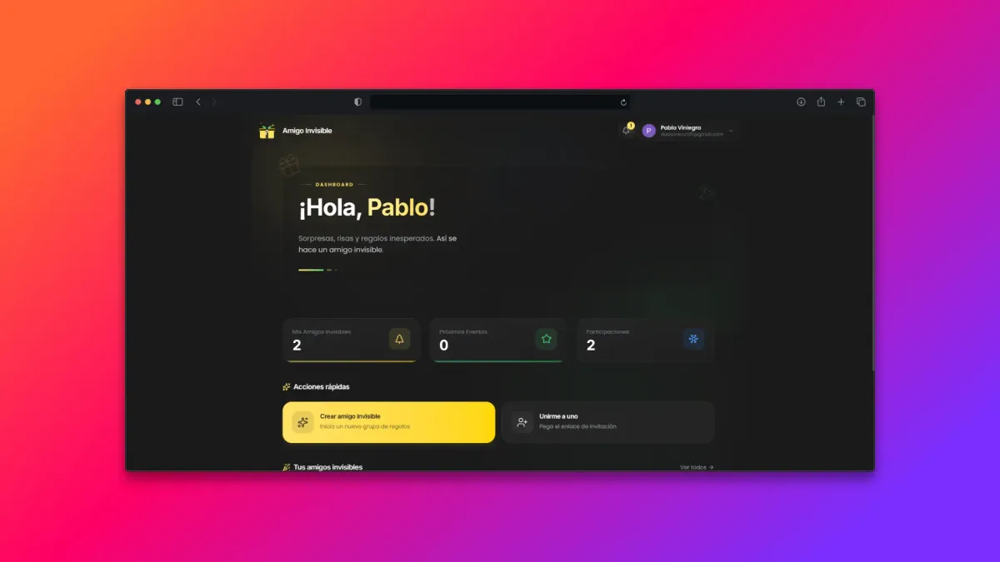
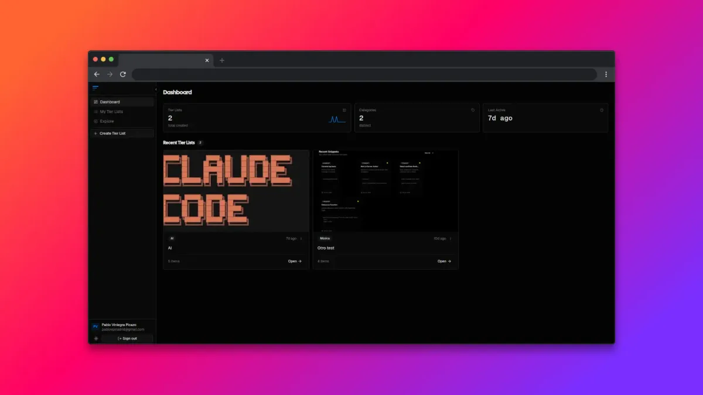
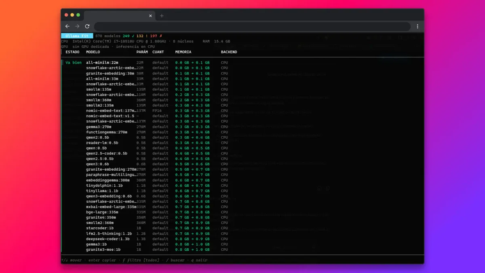

<h1>Hola, soy Pablo</h1>

<strong>Ingeniero de software full stack · Móstoles, Madrid</strong>

<em>Cuando el bug desaparece al poner un console.log.</em>

  <a href="https://pabloviniegra.dev/">Portfolio y casos de estudio</a> ·
  <a href="https://www.linkedin.com/in/pablo-viniegra-picazo/">LinkedIn</a> ·
  <a href="mailto:pablovpmadrid@gmail.com">Escríbeme</a>

Hago aplicaciones web, modernizo las que ya existen y trabajo con agentes dentro del repositorio. A veces todo eso significa averiguar por qué un componente se ha renderizado otra vez.

Trabajo en Minsait (Indra) para BBVA con Vue.js, React y Python. Por aquí encontrarás proyectos personales, herramientas de terminal y alguna excusa para abrir otro repositorio.

## Mi relación con el código heredado es seria

En el trabajo me toca mejorar aplicaciones que la gente ya está usando. El botón tiene que seguir funcionando mientras cambiamos lo que hay debajo.

- Migro aplicaciones de Vue 2 a Vue 3 y añado tests donde antes había fe.
- Optimizo la carga de datos y el renderizado. Que React pueda volver a renderizar no significa que deba hacerlo.
- Preparo flujos de trabajo con agentes para que el equipo pueda usarlos desde el repositorio.

Antes, en Imagar, desarrollé integraciones para AENA y aerolíneas, además de automatizaciones con Azure y Power Platform.

## El «ya que estamos» hecho repositorio

### Santa App

El Amigo Invisible parece fácil hasta que aparecen las parejas, las exclusiones y el «a mí me tocó esa persona el año pasado». Santa App reúne eventos, reglas del sorteo, listas de deseos y notificaciones por correo.

Nuxt / Vue / TypeScript / PostgreSQL / Drizzle / Better Auth

[Probar Santa App](https://santa-app.pabloviniegra.dev/) · [Leer el caso de estudio](https://pabloviniegra.dev/projects/santa-app)

### Tier Maker

Para poner cosas en tier S y discutirlo después. Un editor de tier lists con presets, exportación a PNG y recuperación local del trabajo. Incluye exploración pública y likes para compartir las clasificaciones.

Next.js / React / TypeScript / PostgreSQL / Drizzle / Better Auth

[Crear una tier list](https://tiermaker.pabloviniegra.dev/) · [Leer el caso de estudio](https://pabloviniegra.dev/projects/tier-maker) · [Código](https://github.com/PabloViniegra/tier-maker)

### Ollama-Fit

Antes de descargar otro modelo que no cabe en tu equipo, mejor echar cuentas. Ollama-Fit estima qué modelos locales encajan en tu hardware desde la terminal: TUI, comandos `fit`, `local` y `doctor`, salida JSON y binarios multiplataforma.

Son estimaciones de compatibilidad, no benchmarks. La RAM no se amplía por optimismo.

Go

[Descargar Ollama-Fit](https://github.com/PabloViniegra/tui-ollama-go/releases) · [Leer el caso de estudio](https://pabloviniegra.dev/projects/ollama-fit) · [Código](https://github.com/PabloViniegra/tui-ollama-go)

## Los agentes también necesitan leer el README

Uso Claude Code, MCPs y Agent Skills para escribir código, revisar cambios y operar sobre repositorios. También trabajo con OpenCode y GitHub Copilot CLI para tareas puntuales.

En BBVA he implantado un flujo agéntico compartido por el equipo, aplicado a migraciones y testing de código heredado. Las instrucciones, skills, hooks y servidores MCP forman parte del flujo del repositorio.

El agente propone. Los tests y la revisión tienen algo que decir.

[Cómo trabajo con agentes y qué he aplicado en el equipo](https://pabloviniegra.dev/#ai)

## La caja de herramientas

Para lo que se ve y lo que responde detrás:

  

  

También trabajo con SQL Server, MySQL, MongoDB, Docker, Azure y Google Cloud. Git para dejar constancia de todo lo anterior.

Certificaciones: Google Cloud Digital Leader (2025) y Microsoft Power Platform Developer Associate (2024).

## ¿Hablamos?

Estoy disponible para unirme a un equipo de producto. Si quieres hablar de un proyecto, de código heredado o de por qué ese test solo falla en CI, escríbeme.

[Escríbeme](mailto:pablovpmadrid@gmail.com) · [Consulta mi CV](https://pabloviniegra.dev/CV/CV_2026.pdf)
